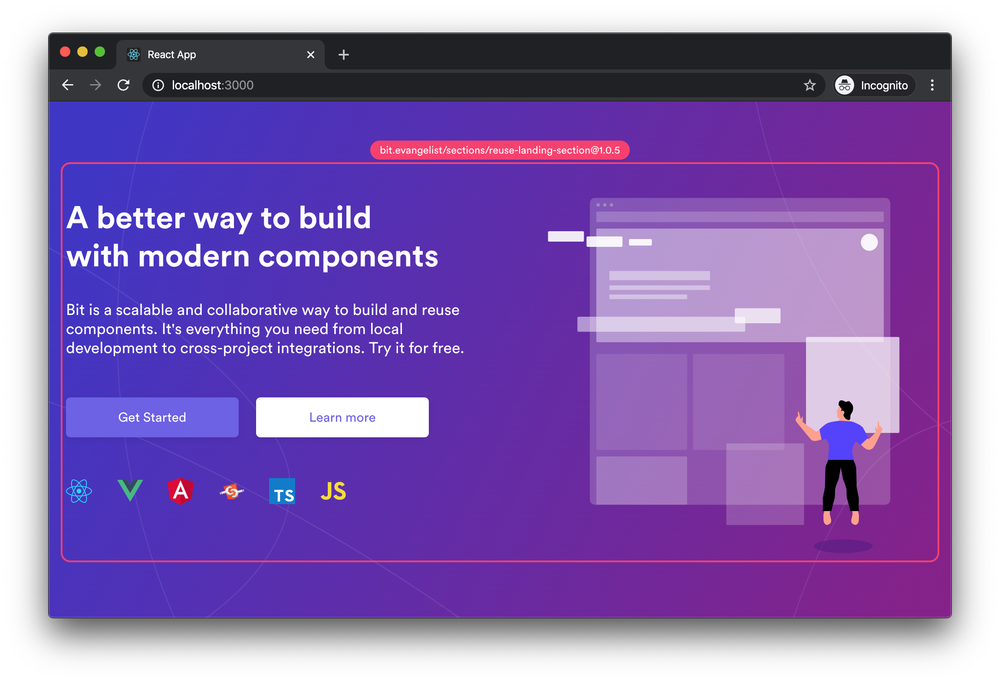

# Evangelist homepage

A modern component-first website.

## Structure:

-   App.tsx - project root

### Components specific to the homepage:
Exported to [bit.evangelist](https://bit.dev/bit/evangelist)

-   src/pages - full page with margins, backgrounds, and texts. (Currently, only hybrid-homepage is in use)
-   src/sections - individual areas of the page that contain most of the content, and can be reused between pages. Should not include margins backgrounds and paddings, as the final page manages and groups sections.
-   src/content - raw json objects input for visual components.
-   src/concrete - components specific to this homepage. They are still abstract and should not contain texts and content.

### Base components, shared among projects
Exported to [bit.base](https://bit.dev/bit/base)
-   src/themes - all shared styles, colors, sizes, css variables, etc.
-   src/constants - hard coded values, like storage url and enums.
-   src/components/layout - structure components that control the position of elements in the document.
-   src/components/base - generic building blocks for concrete pages. They should not contain any texts or content.
-   src/utils - pure logic and helpers. (no visual components)

## Setup
1. Clone the repository
1. [Install bit](https://docs.bit.dev/docs/installation)
1. Run `yarn install` or `npm install` to install all packages.
1. Run `bit import` to sync components.
1. Start hacking!